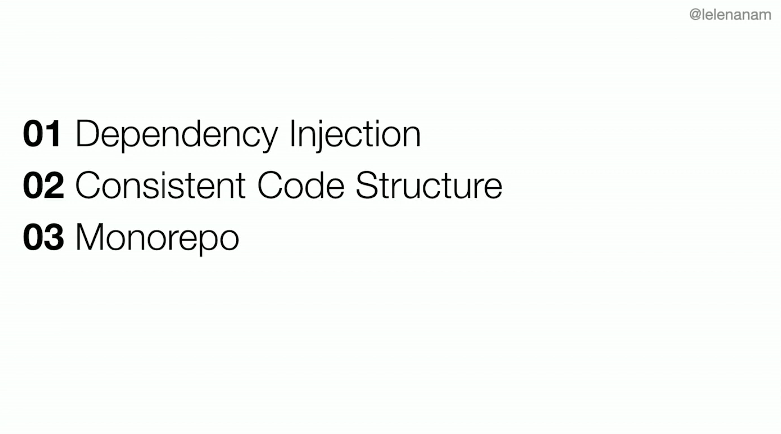
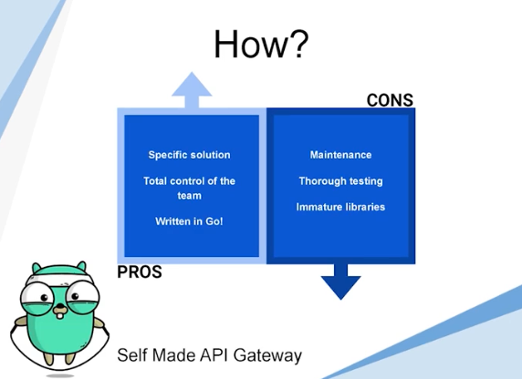
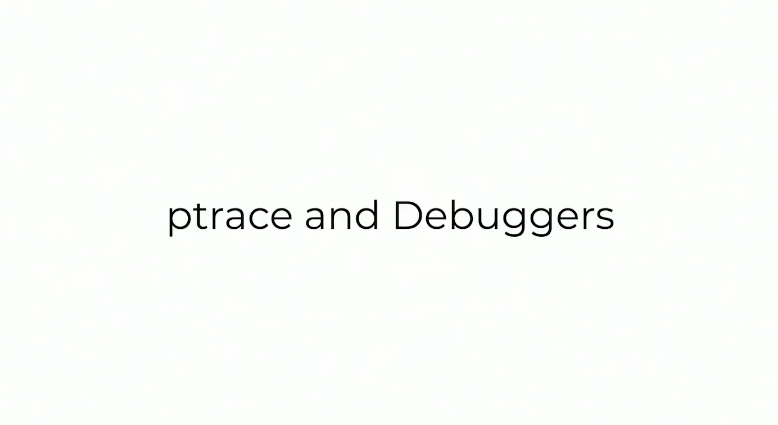
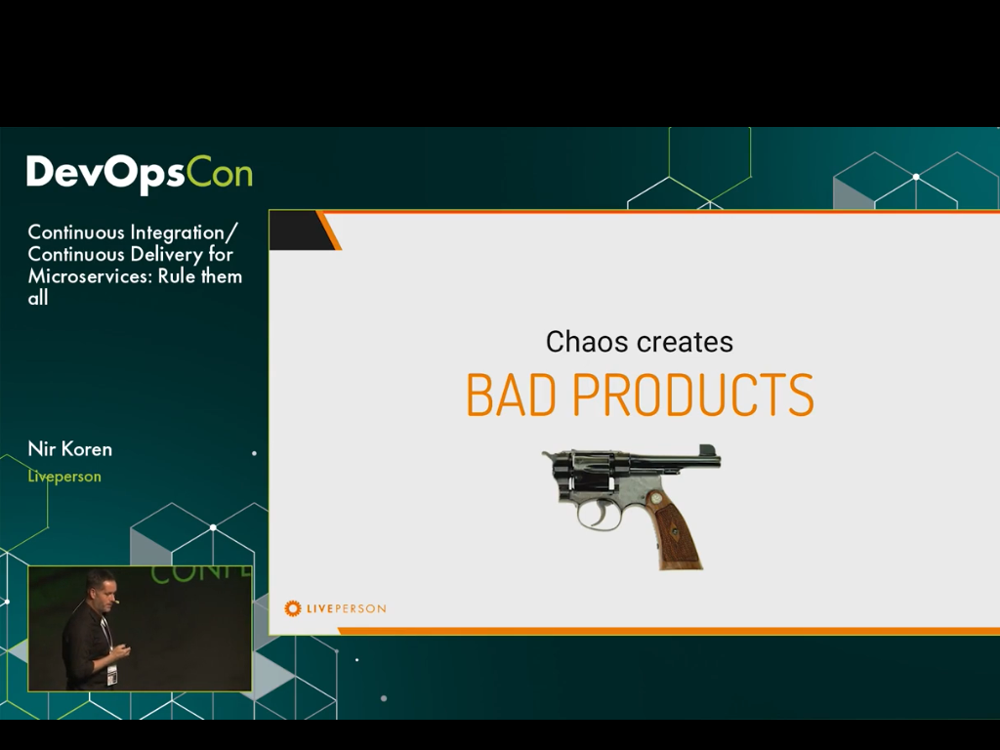
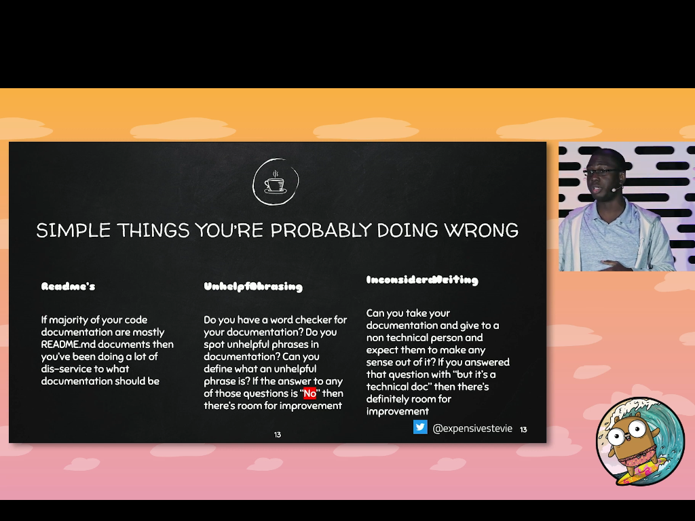

1. [GopherCon EU 2018: Peter Bourgon - Best Practices for Industrial Programming](#1)   
1. [How Do You Structure Your Go Apps? by Kat Zień. GoWayFest 2018 Minsk](#2)   
1. [Golang UK Conference 2015 - Mat Ryer - Building APIs](#3)   
1. [GopherCon Europe 2019: Mat Ryer - How I Write HTTP Web Services After 8 Years](#4)   
1. [GopherCon 2019: Elena Morozova - How Uber Goes](#5)   
1. [GopherCon 2019: Patrick Hawley - Controlling the go runtime](#6)   
1. [GopherCon Europe 2019: Sara Báez García & Carlos González Vila - API Gateway, A Success Story](#7)   
1. [GopherCon 2019: Johan Brandhorst - Get Going with WebAssembly](#8)   
1. [GopherCon Europe 2019: Hungai Kevin Amuhinda - Distributed Tracing](#9)   
1. [GopherCon 2019: Jason Keene - Dynamically Instrumenting Go Programs](#10)   
1. [Continuous Integration/Continuous Delivery for Microservices: Rule them all | Nir Koren](#11)   
1. [GopherCon 2019 Lightning Talk: Kenigbolo Meya Stephen - Continuous Documentation](#12)   

1. [GopherCon EU 2018: Peter Bourgon - Best Practices for Industrial Programming] (https://www.youtube.com/watch?v=PTE4VJIdHPg&t=612s)

2. [How Do You Structure Your Go Apps? by Kat Zień. GoWayFest 2018 Minsk] (https://www.youtube.com/watch?time_continue=30&v=Qtk9FFOoT5M)

3. [Golang UK Conference 2015 - Mat Ryer - Building APIs] (https://www.youtube.com/watch?v=tIm8UkSf6RA)

4. [GopherCon Europe 2019: Mat Ryer - How I Write HTTP Web Services After 8 Years] (https://www.youtube.com/watch?v=8TLiGHJTlig)

5. [GopherCon 2019: Elena Morozova - How Uber Goes] (https://www.youtube.com/watch?v=nLskCRJOdxM)

6. [GopherCon 2019: Patrick Hawley - Controlling the go runtime] (https://www.youtube.com/watch?v=us9hfJqncV8)

7. [GopherCon Europe 2019: Sara Báez García & Carlos González Vila - API Gateway, A Success Story] (https://www.youtube.com/watch?v=oQI7DZZnwnA)

8. [GopherCon 2019: Johan Brandhorst - Get Going with WebAssembly] (https://www.youtube.com/watch?v=Dxs4LGjmEL4)

9. [GopherCon Europe 2019: Hungai Kevin Amuhinda - Distributed Tracing] (https://www.youtube.com/watch?v=lTJ0L92C-9k)

10. [GopherCon 2019: Jason Keene - Dynamically Instrumenting Go Programs] (https://www.youtube.com/watch?v=de9cVAx6REA)

11. [Continuous Integration/Continuous Delivery for Microservices: Rule them all | Nir Koren] (https://www.youtube.com/watch?v=Qm4uDFPCyiY)

12. [GopherCon 2019 Lightning Talk: Kenigbolo Meya Stephen - Continuous Documentation] (https://www.youtube.com/watch?v=aJgmPCBEtbs)

