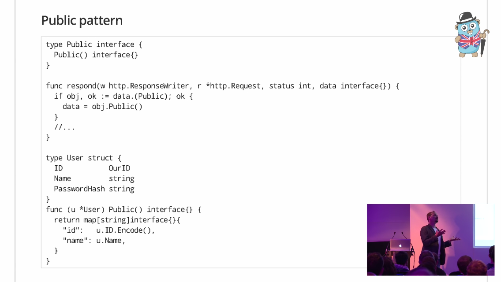

1. [GopherCon EU 2018: Peter Bourgon - Best Practices for Industrial Programming] (https://www.youtube.com/watch?v=PTE4VJIdHPg&t=612s)

2. [How Do You Structure Your Go Apps? by Kat Zień. GoWayFest 2018 Minsk] (https://www.youtube.com/watch?time_continue=30&v=Qtk9FFOoT5M)

3. [Golang UK Conference 2015 - Mat Ryer - Building APIs] (https://www.youtube.com/watch?v=tIm8UkSf6RA)

